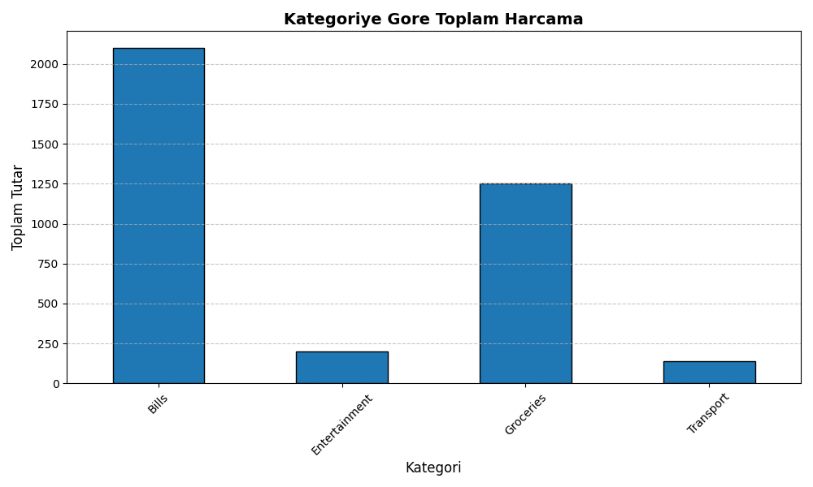
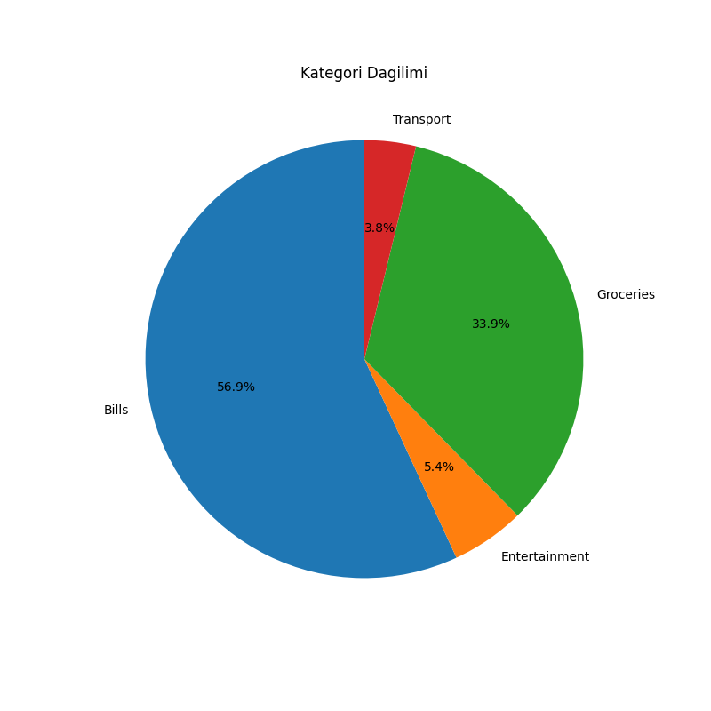
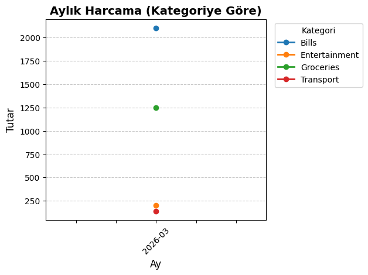

# 💰 Budget Guard

Budget Guard is a simple Python project that analyzes personal expenses using data visualization.

## 📊 Features

- Reads expense data from a CSV file (including dates for time-based views)
- Prints **monthly spending summary**: total per month and breakdown by category
- Calculates total spending by category
- Identifies the highest spending category
- Generates visual insights:
  - Bar chart (total spending by category) → `chart.png`
  - Pie chart (spending distribution) → `pie_chart.png`
  - Line chart (monthly spending by category) → `monthly_line.png`

## 🛠️ Technologies Used

- Python
- Pandas
- Matplotlib

## 📁 Project Structure

budget_guard/
│
├── app.py
├── expenses.csv
├── chart.png
├── pie_chart.png
├── monthly_line.png
└── README.md

## 📈 Sample Outputs

### Bar Chart



### Pie Chart



### Monthly Line Chart



## 📌 Insights

- Bills account for the majority of expenses (~57%)
- Groceries are the second largest category (~34%)
- Entertainment and Transport have minimal impact

## 🚀 How to Run

```bash
pip3 install pandas matplotlib
python3 app.py
```

Running the script prints summaries to the terminal and writes the chart images above into the project folder.
